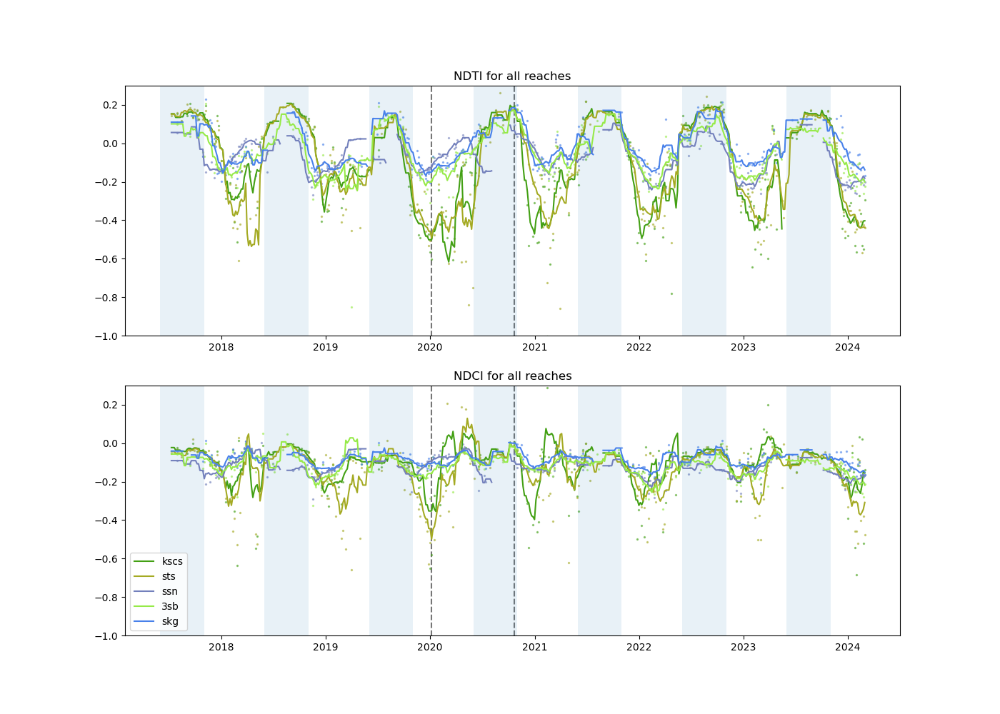

# Tracking water quality over time in the Lower Mekong

[Helen Miller](https://github.com/helenmiller16)

A satellite remote sensing workflow for detecting water quality parameters in the Lower Mekong River basin. 

Future work on this project will be in my [personal repo](https://github.com/helenmiller16/lmb-metabolism-sensing), which will be made public when I publish the results. If you are interested in this work and want access before then for some reason, please contact me via helenm22@uw.edu. 

## Background

The Mekong River is one of the world's largest rivers, and the Lower Mekong Basin (LMB) feeds an estimated 60 million people daily. Its biodiversity and productivity is driven by seasonal fluctuations in flow driven by the monsoonal climate, known as the flood-pulse. The processes driving productivity are likely changing with the onset of widespread deforestation and hydropower dam development in the last two decades ([MRC, 2023](https://www.mrcmekong.org/resource/bd0zhw)). Remote sensing methods exist for some key indicators of water quality, including chlorophyll (an indicator for phytoplankton abundance) and turbidity. Using the Harmonized Landsat Sentinel dataset, this project will track chlorophyll and turbidity over the last decade in all large mainstem and tributary river reaches in the Lower Mekong Basin. 

## Questions  
* How does chlorophyll and turbidity vary across the flood-pulse in the LMB? 
* How have chlorophyll concentrations and turbidity changed in the last decade in the LMB?

## Datasets
* [HydroSHEDs river reaches](https://www.hydrosheds.org/products/hydrorivers) -- for identifying and differentiating river reaches. 
* [JRC water extent](https://global-surface-water.appspot.com/download) -- for delineating where water is (and is not)
* [Harmonized Landsat Sentinel](https://hls.gsfc.nasa.gov/) -- for calculating indices

## Tools/packages

* For working with vector data (stream shapefiles): geopandas
* For working with raster data (water masks and satellite data): rasterio and rioxarray
* For accessing HLS data: [earthaccess](https://github.com/nsidc/earthaccess/) python package. It is an api for accessing NASA earth data. 
    * tutorial [here](https://github.com/nasa/HLS-Data-Resources/blob/main/python/tutorials/HLS_Tutorial.ipynb)
* For determining distance from river reach vectors to raster points: [distance-rasters](https://github.com/sgoodm/python-distance-rasters) 

## Methodology: 

The data processing for this project will largely follow methods from [Gardner et al, 2021](https://agupubs.onlinelibrary.wiley.com/doi/10.1029/2020GL088946) for retrieving remote sensing reflectance associated with individual river reaches. [04_presentation.ipynb](04_presentation.ipynb) provides an overview of all the steps with plots and code snippets. This will involve: 

1. [Create water masks for each river reach](01_river_reach_masks.ipynb): 
    1. Identify river reaches of interest 
    1. Create a buffer around those river reaches
    1. Identify water pixels within the buffer
    1. Associate water pixels based on distance from river reach
1. [Get time series of median NDCI and NDTI indices for each river reach](02_pull_hls.ipynb): 
    1. Pull reflectance for river reach mask for one satellite image (R,G,VNIR)
    1. Remove clouds, cloud shadows, or any pixels which did not pass QC. 
    1. Record the number (or percentage) of pixels which DID pass QC. 
    1. Calculate median NDCI and NDTI for remaining pixels
    1. Repeat for all river reaches and all images
1. [Analyze time series](03_timeseries.ipynb)
    1. Plot indices over time

__Chlorophyll and turbidity indices__: 

I will use the [Normalized Difference Chlorophyll Index](https://doi.org/10.1016/j.rse.2011.10.016) (NDCI) and [Normalized Difference Turbidity Index](https://doi.org/10.1016/j.rse.2006.07.012) (NDTI) to estimate chlorophyll-a concentration and turbidity, respectively. 

NDCI is a function of reflectance in visible near infrared and red bands ([Mishra & Mishra, 2012](https://doi.org/10.1016/j.rse.2011.10.016)), and NDTI is a function of reflectance in red and green bands ([Lacaux et al. 2007](https://doi.org/10.1016/j.rse.2006.07.012)): 

$$
NDCI = \frac{VNIR - Red}{VNIR + Red}
$$

$$
NDTI = \frac{Red - Green}{Red + Green}
$$

## Results 

__River reach masks__: 

Step 1 generates a raster mask where pixel values indicate which river reach the pixel is associated with. This is the resulting mask: 

__Time series__: 

Here is a time series of NDCI and NDVI for the five river reaches. The shaded blue background is between June and November, roughly lining up with wet season. 

## Conclusions and next steps

* Higher turbidity during the wet season
* Less clear pattern in chlorophyll: maybe peak during end of dry season
* Greater range in chlorophyll and turbidity in KSCS and STS reaches (Mekong mainstem)

No long-term water quality datasets exist at large spatial scales for the LMB. This analysis shows that chlorophyll and turbidity can be estimated in the LMB using satellite remote sensing. By extending this analysis over a longer time period and over the rest of the river basin, it can be used to asses how water quality is changing over time, and link changes in water quality to changes in water and land use. 

## References

MRC. (2023). Technical Report – Phase 1 of the Joint study on the Changing Patterns of Hydrological Conditions of the Lancang-Mekong River Basin and Adaptation Strategies . Vientiane: MRC Secretariat. https://doi.org/10.52107/mrc.bd0zhw 

Gardner, J. R., et al. (2021). The color of rivers. Geophysical Research Letters, 48, e2020GL088946. https://doi.org/10.1029/2020GL088946 

Mishra, Sachidananda & Mishra, Deepak. (2012). Normalized difference chlorophyll index: A novel model for remote estimation of chlorophyll-a concentration in turbid productive waters. Remote Sensing of Environment. 117. 394-406. https://doi.org/10.1016/j.rse.2011.10.016 

Lacaux, J. P., et al. (2007). Classification of ponds from high-spatial resolution remote sensing: Application to Rift Valley Fever epidemics in Senegal. Remote sensing of environment 106.1. https://doi.org/10.1016/j.rse.2006.07.012